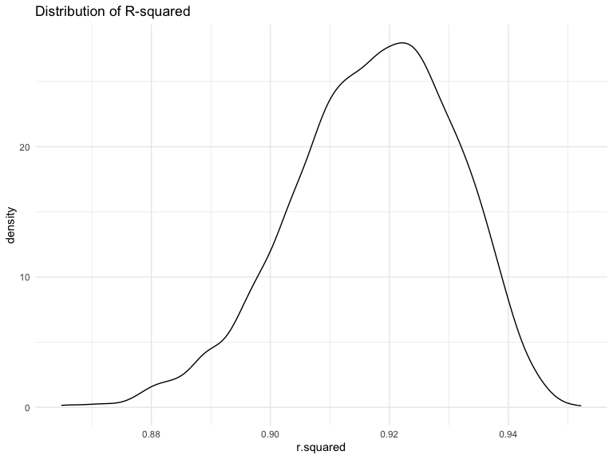
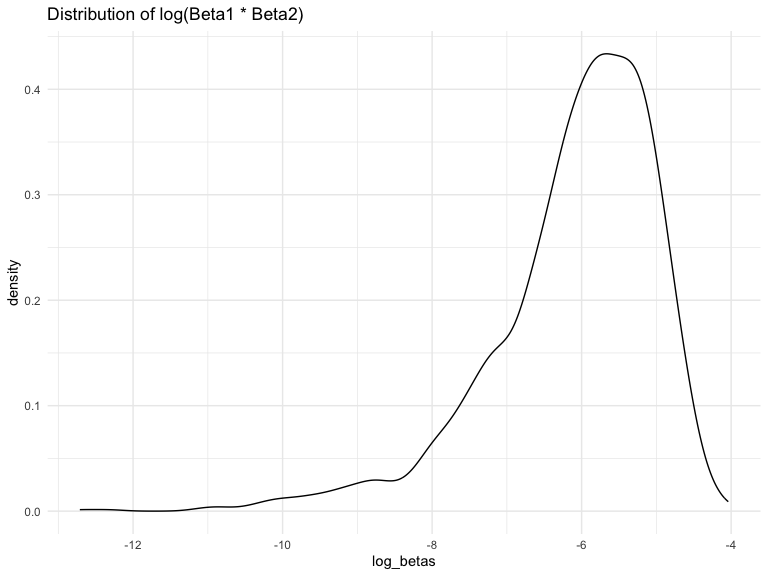
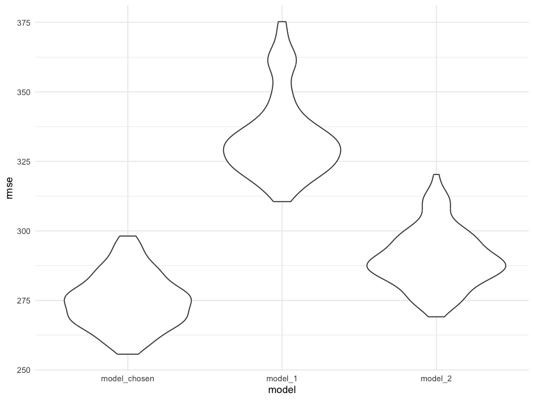

p8105_hw6_yl5219
================
Yuqing Liu
2023-11-30

### Problem 1

In the data cleaning code below we create a `city_state` variable,
change `victim_age` to numeric, modifiy victim_race to have categories
white and non-white, with white as the reference category, and create a
`resolution` variable indicating whether the homicide is solved. Lastly,
we filtered out the following cities: Tulsa, AL; Dallas, TX; Phoenix,
AZ; and Kansas City, MO; and we retained only the variables
`city_state`, `resolution`, `victim_age`, `victim_sex`, and
`victim_race`.

``` r
homicide_df = 
  read_csv("./homicide-data.csv", na = c("", "NA", "Unknown")) |> 
  mutate(
    city_state = str_c(city, state, sep = ", "),
    victim_age = as.numeric(victim_age),
    resolution = case_when(
      disposition == "Closed without arrest" ~ 0,
      disposition == "Open/No arrest"        ~ 0,
      disposition == "Closed by arrest"      ~ 1)
  ) |> 
  filter(victim_race %in% c("White", "Black")) |> 
  filter(!(city_state %in% c("Tulsa, AL", "Dallas, TX", "Phoenix, AZ", "Kansas City, MO"))) |> 
  select(city_state, resolution, victim_age, victim_sex, victim_race)
```

    ## Rows: 52179 Columns: 12
    ## ── Column specification ────────────────────────────────────────────────────────
    ## Delimiter: ","
    ## chr (8): uid, victim_last, victim_first, victim_race, victim_sex, city, stat...
    ## dbl (4): reported_date, victim_age, lat, lon
    ## 
    ## ℹ Use `spec()` to retrieve the full column specification for this data.
    ## ℹ Specify the column types or set `show_col_types = FALSE` to quiet this message.

Next we fit a logistic regression model using only data from Baltimore,
MD. We model `resolved` as the outcome and `victim_age`, `victim_sex`,
and `victim_race` as predictors. We save the output as `baltimore_glm`
so that we can apply `broom::tidy` to this object and obtain the
estimate and confidence interval of the adjusted odds ratio for solving
homicides comparing non-white victims to white victims.

``` r
baltimore_glm = 
  filter(homicide_df, city_state == "Baltimore, MD") |> 
  glm(resolution ~ victim_age + victim_sex + victim_race, family = binomial(), data = _)

baltimore_glm |> 
  broom::tidy() |> 
  mutate(
    OR = exp(estimate), 
    OR_CI_upper = exp(estimate + 1.96 * std.error),
    OR_CI_lower = exp(estimate - 1.96 * std.error)) |> 
  filter(term == "victim_sexMale") |> 
  select(OR, OR_CI_lower, OR_CI_upper) |>
  knitr::kable(digits = 3)
```

|    OR | OR_CI_lower | OR_CI_upper |
|------:|------------:|------------:|
| 0.426 |       0.325 |       0.558 |

Below, by incorporating `nest()`, `map()`, and `unnest()` into the
preceding Baltimore-specific code, we fit a model for each of the
cities, and extract the adjusted odds ratio (and CI) for solving
homicides comparing non-white victims to white victims. We show the
first 5 rows of the resulting dataframe of model results.

``` r
model_results = 
  homicide_df |> 
  nest(data = -city_state) |> 
  mutate(
    models = map(data, \(df) glm(resolution ~ victim_age + victim_sex + victim_race, 
                             family = binomial(), data = df)),
    tidy_models = map(models, broom::tidy)) |> 
  select(-models, -data) |> 
  unnest(cols = tidy_models) |> 
  mutate(
    OR = exp(estimate), 
    OR_CI_upper = exp(estimate + 1.96 * std.error),
    OR_CI_lower = exp(estimate - 1.96 * std.error)) |> 
  filter(term == "victim_sexMale") |> 
  select(city_state, OR, OR_CI_lower, OR_CI_upper)

model_results |>
  slice(1:5) |> 
  knitr::kable(digits = 3)
```

| city_state      |    OR | OR_CI_lower | OR_CI_upper |
|:----------------|------:|------------:|------------:|
| Albuquerque, NM | 1.767 |       0.831 |       3.761 |
| Atlanta, GA     | 1.000 |       0.684 |       1.463 |
| Baltimore, MD   | 0.426 |       0.325 |       0.558 |
| Baton Rouge, LA | 0.381 |       0.209 |       0.695 |
| Birmingham, AL  | 0.870 |       0.574 |       1.318 |

Below we generate a plot of the estimated ORs and CIs for each city,
ordered by magnitude of the OR from smallest to largest. From this plot
we see that most cities have odds ratios that are smaller than 1,
suggesting that crimes with male victims have smaller odds of resolution
compared to crimes with female victims after adjusting for victim age
and race. This disparity is strongest in New yrok. In roughly half of
these cities, confidence intervals are narrow and do not contain 1,
suggesting a significant difference in resolution rates by sex after
adjustment for victim age and race.

``` r
model_results |> 
  mutate(city_state = fct_reorder(city_state, OR)) |> 
  ggplot(aes(x = city_state, y = OR)) + 
  geom_point() + 
  geom_errorbar(aes(ymin = OR_CI_lower, ymax = OR_CI_upper)) + 
  theme(axis.text.x = element_text(angle = 90, hjust = 1))
```


### Problem 2

**Import dataset**

``` r
weather_df = 
  rnoaa::meteo_pull_monitors(
    c("USW00094728"),
    var = c("PRCP", "TMIN", "TMAX"), 
    date_min = "2022-01-01",
    date_max = "2022-12-31") |>
  mutate(
    name = recode(id, USW00094728 = "CentralPark_NY"),
    tmin = tmin / 10,
    tmax = tmax / 10) |>
  select(name, id, everything())
```

    ## using cached file: /Users/apple/Library/Caches/org.R-project.R/R/rnoaa/noaa_ghcnd/USW00094728.dly

    ## date created (size, mb): 2023-09-28 10:18:52.967797 (8.524)

    ## file min/max dates: 1869-01-01 / 2023-09-30

**Build a regression model for `tmax`**

``` r
model_tmax <- lm(tmax ~ tmin + prcp, data = weather_df)
summary(model_tmax)
```

    ## 
    ## Call:
    ## lm(formula = tmax ~ tmin + prcp, data = weather_df)
    ## 
    ## Residuals:
    ##     Min      1Q  Median      3Q     Max 
    ## -6.3705 -1.9950 -0.0249  1.4974 20.4503 
    ## 
    ## Coefficients:
    ##              Estimate Std. Error t value Pr(>|t|)    
    ## (Intercept)  8.042803   0.230065  34.959   <2e-16 ***
    ## tmin         1.013386   0.016154  62.734   <2e-16 ***
    ## prcp        -0.001541   0.002103  -0.733    0.464    
    ## ---
    ## Signif. codes:  0 '***' 0.001 '**' 0.01 '*' 0.05 '.' 0.1 ' ' 1
    ## 
    ## Residual standard error: 2.956 on 362 degrees of freedom
    ## Multiple R-squared:  0.916,  Adjusted R-squared:  0.9155 
    ## F-statistic:  1972 on 2 and 362 DF,  p-value: < 2.2e-16

**Perform bootstrap analysis for $\hat r^2$ and
$\log(\hat\beta_1\times \hat\beta_2)$** **Set seed**

``` r
set.seed(123)
```

**Write a function to generate 5000 bootstraps samples**

``` r
boot_sample = function(df) {
  sample_frac(df, replace = TRUE)
}
```

**Generate 5000 bootstraps samples**

``` r
boot_straps = 
  tibble(strap_number = 1:5000) |> 
  mutate(
    strap_sample = map(strap_number, \(i) boot_sample(df = weather_df))
  )

boot_straps
```

    ## # A tibble: 5,000 × 2
    ##    strap_number strap_sample      
    ##           <int> <list>            
    ##  1            1 <tibble [365 × 6]>
    ##  2            2 <tibble [365 × 6]>
    ##  3            3 <tibble [365 × 6]>
    ##  4            4 <tibble [365 × 6]>
    ##  5            5 <tibble [365 × 6]>
    ##  6            6 <tibble [365 × 6]>
    ##  7            7 <tibble [365 × 6]>
    ##  8            8 <tibble [365 × 6]>
    ##  9            9 <tibble [365 × 6]>
    ## 10           10 <tibble [365 × 6]>
    ## # ℹ 4,990 more rows

**Combine 5000 bootstraps results**

``` r
bootstrap_results = 
  boot_straps %>% 
  mutate(
    models = map(strap_sample, ~lm(tmax ~ tmin + prcp, data = .x) ),
    results = map(models, broom::tidy)) %>% 
  select(-strap_sample, -models) %>% 
  unnest(results) 
```

**Compute the log of the product of beta estimates
$\log(\hat\beta_1\times \hat\beta_2)$ of 5000 bootstraps**

``` r
log_betas <-  
  bootstrap_results %>%
  group_by(strap_number) %>%
  summarise(log_betas = log(estimate[2] * estimate[3])) %>%
  select(log_betas, strap_number)
```

**Generate another 5000 bootstrap estimates**

``` r
bootstrap_results2 <- 
  boot_straps %>% 
  mutate(
    models = map(strap_sample, ~lm(tmax ~ tmin + prcp, data = .x) ),
    results = map(models, broom::glance)) %>% 
  select(-strap_sample, -models) %>% 
  unnest(results) 
```

**Compute the R-Squared $\hat r^2$ of 5000 bootstraps**

``` r
r_squared <- 
  bootstrap_results2 %>%
  select(r.squared, strap_number)
```

**Fit density plot of the product of beta estimates
$\log(\hat\beta_1\times \hat\beta_2)$**

``` r
log_betas_sd <- 
  log_betas %>%
  summarise(log_betas_sd = sd(as.numeric(log_betas),na.rm = TRUE)) %>%
  pull(log_betas_sd)

log_betas_mean <- 
  log_betas %>% 
  summarise(log_betas_mean = mean(as.numeric(log_betas), na.rm = TRUE)) %>%
  pull(log_betas_mean)

log_betas %>%
  ggplot(aes(x = log_betas)) + geom_density() +
  labs(title = "Distribution of log(Beta1 * Beta2)")
```



**Discussion:** The density curve of the the product of two beta
estimates $\log(\hat\beta_1\times \hat\beta_2)$ is left-skewed. Its mean
is approximately-6.106, and its standard deviation is approximately
1.1136.

**Fit density plot of R-Squared $\hat r^2$ **

``` r
r_squared_sd <-
  r_squared %>%
  summarise(r_squared_sd = sd(r.squared)) %>%
  pull(r_squared_sd)

r_squared_mean <-
  r_squared %>%
  summarise(r_squared_mean = mean(r.squared)) %>%
  pull(r_squared_mean)

r_squared %>%
  ggplot(aes(x = r.squared)) + geom_density()+
  labs(title = "Distribution of R-squared")
```



**Discussion:** The density curve of R-Squared $\hat r^2$ is slightly
left-skewed. Its mean is approximately 0.9173 and its standard deviation
is approximately 0.0136.

**95% CI of log of the product of beta estimates
$\log(\hat\beta_1\times \hat\beta_2)$**

``` r
CI_result <-
  log_betas %>%
  summarize(ci_lower = quantile(log_betas, 0.025, na.rm = TRUE),
            ci_upper = quantile(log_betas, 0.975, na.rm = TRUE))

CI_result_lower <- CI_result %>% pull(ci_lower)
CI_result_upper <- CI_result %>% pull(ci_upper)
```

**Discussion:** The 95% Confidence Interval of the product of beta
estimates $\log(\hat\beta_1\times \hat\beta_2)$ is (-9.0632,-4.6193).

**95% CI of the R-Squared $\hat r^2$**

``` r
CI_result2 <-
  r_squared %>%
  summarize(ci_lower = quantile(r.squared, 0.025),
            ci_upper = quantile(r.squared, 0.975)) 

CI_result_lower2 <- CI_result2 %>% pull(ci_lower)
CI_result_upper2 <- CI_result2 %>% pull(ci_upper)
```

**Discussion:** The 95% Confidence Interval of the product of beta
estimates $\hat r^2$ is (0.8882,0.9403).

### Problem 3

**Import and clean dataset**

``` r
birthweight_df = 
  read_csv("./birthweight.csv")|>
  mutate(babysex = factor(babysex), frace = factor(frace), malform = factor(malform),
         mrace = factor(mrace)) |>
  mutate(babysex = ifelse(babysex == "1", "male","female"),
         malform = ifelse(malform == "0", "absent","present"),
         frace = recode(frace, "1" = "White", "2" = "Black", "3" = "Asian", 
                        "4" = "Puerto Rican", "8" = "Other", "9" = "Unknown"),
         mrace = recode(mrace, "1" = "White", "2" = "Black", 
                        "3" = "Asian", "4" = "Puerto Rican", "8" = "Other")
         )
```

    ## Rows: 4342 Columns: 20
    ## ── Column specification ────────────────────────────────────────────────────────
    ## Delimiter: ","
    ## dbl (20): babysex, bhead, blength, bwt, delwt, fincome, frace, gaweeks, malf...
    ## 
    ## ℹ Use `spec()` to retrieve the full column specification for this data.
    ## ℹ Specify the column types or set `show_col_types = FALSE` to quiet this message.

**Check for missing data**

``` r
skimr::skim(birthweight_df)
```

|                                                  |                |
|:-------------------------------------------------|:---------------|
| Name                                             | birthweight_df |
| Number of rows                                   | 4342           |
| Number of columns                                | 20             |
| \_\_\_\_\_\_\_\_\_\_\_\_\_\_\_\_\_\_\_\_\_\_\_   |                |
| Column type frequency:                           |                |
| character                                        | 2              |
| factor                                           | 2              |
| numeric                                          | 16             |
| \_\_\_\_\_\_\_\_\_\_\_\_\_\_\_\_\_\_\_\_\_\_\_\_ |                |
| Group variables                                  | None           |

Data summary

**Variable type: character**

| skim_variable | n_missing | complete_rate | min | max | empty | n_unique | whitespace |
|:--------------|----------:|--------------:|----:|----:|------:|---------:|-----------:|
| babysex       |         0 |             1 |   4 |   6 |     0 |        2 |          0 |
| malform       |         0 |             1 |   6 |   7 |     0 |        2 |          0 |

**Variable type: factor**

| skim_variable | n_missing | complete_rate | ordered | n_unique | top_counts                              |
|:--------------|----------:|--------------:|:--------|---------:|:----------------------------------------|
| frace         |         0 |             1 | FALSE   |        5 | Whi: 2123, Bla: 1911, Pue: 248, Asi: 46 |
| mrace         |         0 |             1 | FALSE   |        4 | Whi: 2147, Bla: 1909, Pue: 243, Asi: 43 |

**Variable type: numeric**

| skim_variable | n_missing | complete_rate |    mean |     sd |     p0 |     p25 |     p50 |     p75 |   p100 | hist  |
|:--------------|----------:|--------------:|--------:|-------:|-------:|--------:|--------:|--------:|-------:|:------|
| bhead         |         0 |             1 |   33.65 |   1.62 |  21.00 |   33.00 |   34.00 |   35.00 |   41.0 | ▁▁▆▇▁ |
| blength       |         0 |             1 |   49.75 |   2.72 |  20.00 |   48.00 |   50.00 |   51.00 |   63.0 | ▁▁▁▇▁ |
| bwt           |         0 |             1 | 3114.40 | 512.15 | 595.00 | 2807.00 | 3132.50 | 3459.00 | 4791.0 | ▁▁▇▇▁ |
| delwt         |         0 |             1 |  145.57 |  22.21 |  86.00 |  131.00 |  143.00 |  157.00 |  334.0 | ▅▇▁▁▁ |
| fincome       |         0 |             1 |   44.11 |  25.98 |   0.00 |   25.00 |   35.00 |   65.00 |   96.0 | ▃▇▅▂▃ |
| gaweeks       |         0 |             1 |   39.43 |   3.15 |  17.70 |   38.30 |   39.90 |   41.10 |   51.3 | ▁▁▂▇▁ |
| menarche      |         0 |             1 |   12.51 |   1.48 |   0.00 |   12.00 |   12.00 |   13.00 |   19.0 | ▁▁▂▇▁ |
| mheight       |         0 |             1 |   63.49 |   2.66 |  48.00 |   62.00 |   63.00 |   65.00 |   77.0 | ▁▁▇▂▁ |
| momage        |         0 |             1 |   20.30 |   3.88 |  12.00 |   18.00 |   20.00 |   22.00 |   44.0 | ▅▇▂▁▁ |
| parity        |         0 |             1 |    0.00 |   0.10 |   0.00 |    0.00 |    0.00 |    0.00 |    6.0 | ▇▁▁▁▁ |
| pnumlbw       |         0 |             1 |    0.00 |   0.00 |   0.00 |    0.00 |    0.00 |    0.00 |    0.0 | ▁▁▇▁▁ |
| pnumsga       |         0 |             1 |    0.00 |   0.00 |   0.00 |    0.00 |    0.00 |    0.00 |    0.0 | ▁▁▇▁▁ |
| ppbmi         |         0 |             1 |   21.57 |   3.18 |  13.07 |   19.53 |   21.03 |   22.91 |   46.1 | ▃▇▁▁▁ |
| ppwt          |         0 |             1 |  123.49 |  20.16 |  70.00 |  110.00 |  120.00 |  134.00 |  287.0 | ▅▇▁▁▁ |
| smoken        |         0 |             1 |    4.15 |   7.41 |   0.00 |    0.00 |    0.00 |    5.00 |   60.0 | ▇▁▁▁▁ |
| wtgain        |         0 |             1 |   22.08 |  10.94 | -46.00 |   15.00 |   22.00 |   28.00 |   89.0 | ▁▁▇▁▁ |

**Discussion:** The cleaned dataset has no missing value. The dataset
has 20 variables and 4342 observations. The variables included in this
datasets are babysex, bhead, blength, bwt, delwt, fincome, frace,
gaweeks, malform, menarche, mheight, momage, mrace, parity, pnumlbw,
pnumsga, ppbmi, ppwt, smoken, wtgain.

**Build a regression model for birthweight** Try to create a model with
all the predictive variables available:

``` r
model_all <- lm(bwt ~ ., data = birthweight_df)
summary(model_all)
```

    ## 
    ## Call:
    ## lm(formula = bwt ~ ., data = birthweight_df)
    ## 
    ## Residuals:
    ##      Min       1Q   Median       3Q      Max 
    ## -1097.68  -184.86    -3.33   173.09  2344.15 
    ## 
    ## Coefficients: (3 not defined because of singularities)
    ##                     Estimate Std. Error t value Pr(>|t|)    
    ## (Intercept)       -6236.6841   660.1884  -9.447  < 2e-16 ***
    ## babysexmale         -28.7073     8.4652  -3.391 0.000702 ***
    ## bhead               130.7781     3.4523  37.881  < 2e-16 ***
    ## blength              74.9536     2.0217  37.075  < 2e-16 ***
    ## delwt                 4.1007     0.3948  10.386  < 2e-16 ***
    ## fincome               0.2898     0.1795   1.614 0.106551    
    ## fraceBlack           14.3313    46.1501   0.311 0.756168    
    ## fraceAsian           21.2361    69.2960   0.306 0.759273    
    ## fracePuerto Rican   -46.9962    44.6782  -1.052 0.292912    
    ## fraceOther            4.2969    74.0741   0.058 0.953745    
    ## gaweeks              11.5494     1.4654   7.882 4.06e-15 ***
    ## malformpresent        9.7650    70.6259   0.138 0.890039    
    ## menarche             -3.5508     2.8951  -1.226 0.220083    
    ## mheight               9.7874    10.3116   0.949 0.342588    
    ## momage                0.7593     1.2221   0.621 0.534418    
    ## mraceBlack         -151.4354    46.0453  -3.289 0.001014 ** 
    ## mraceAsian          -91.3866    71.9190  -1.271 0.203908    
    ## mracePuerto Rican   -56.4787    45.1369  -1.251 0.210901    
    ## parity               95.5411    40.4793   2.360 0.018307 *  
    ## pnumlbw                   NA         NA      NA       NA    
    ## pnumsga                   NA         NA      NA       NA    
    ## ppbmi                 4.3538    14.8913   0.292 0.770017    
    ## ppwt                 -3.4716     2.6121  -1.329 0.183913    
    ## smoken               -4.8544     0.5871  -8.269  < 2e-16 ***
    ## wtgain                    NA         NA      NA       NA    
    ## ---
    ## Signif. codes:  0 '***' 0.001 '**' 0.01 '*' 0.05 '.' 0.1 ' ' 1
    ## 
    ## Residual standard error: 272.5 on 4320 degrees of freedom
    ## Multiple R-squared:  0.7183, Adjusted R-squared:  0.717 
    ## F-statistic: 524.6 on 21 and 4320 DF,  p-value: < 2.2e-16

**Comment:** The linear regression model with dependent variable of
baby’s birth weight (grams) and independent variable of all other
variablse as predictors showed some variables are statistically
signification in their association with baby’s birth weight. So, I will
include them in my chosen model.

The model that I choose:

``` r
model_chosen <- lm(bwt ~ babysex + bhead + blength + delwt + gaweeks + mrace + parity + smoken, data = birthweight_df)
summary(model_chosen)
```

    ## 
    ## Call:
    ## lm(formula = bwt ~ babysex + bhead + blength + delwt + gaweeks + 
    ##     mrace + parity + smoken, data = birthweight_df)
    ## 
    ## Residuals:
    ##      Min       1Q   Median       3Q      Max 
    ## -1119.67  -181.24    -5.87   173.51  2340.76 
    ## 
    ## Coefficients:
    ##                     Estimate Std. Error t value Pr(>|t|)    
    ## (Intercept)       -5793.9324    97.6502 -59.334  < 2e-16 ***
    ## babysexmale         -28.6609     8.4951  -3.374 0.000748 ***
    ## bhead               131.6982     3.4607  38.056  < 2e-16 ***
    ## blength              75.8653     2.0210  37.538  < 2e-16 ***
    ## delwt                 2.2649     0.1961  11.550  < 2e-16 ***
    ## gaweeks              12.1400     1.4654   8.284  < 2e-16 ***
    ## mraceBlack         -146.7893     9.2435 -15.880  < 2e-16 ***
    ## mraceAsian          -71.5880    42.4809  -1.685 0.092026 .  
    ## mracePuerto Rican  -119.5979    18.7656  -6.373 2.04e-10 ***
    ## parity               98.6113    40.5334   2.433 0.015021 *  
    ## smoken               -4.7472     0.5882  -8.071 8.96e-16 ***
    ## ---
    ## Signif. codes:  0 '***' 0.001 '**' 0.01 '*' 0.05 '.' 0.1 ' ' 1
    ## 
    ## Residual standard error: 273.8 on 4331 degrees of freedom
    ## Multiple R-squared:  0.7148, Adjusted R-squared:  0.7142 
    ## F-statistic:  1086 on 10 and 4331 DF,  p-value: < 2.2e-16

**Discussion:** I built a linear regression model with the independent
variables (predictors) of baby’s sex, baby’s head circumference at birth
(centimeters), baby’s length at birth (centimeteres), mother’s weight at
delivery (pounds), gestational age in weeks, mother’s race, number of
live births prior to this pregnancy, and average number of cigarettes
smoked per day during pregnancy, and the dependent variable of baby’s
birth weight (grams). In this model, all the predictors are
significantly associated with the outcome baby’s birth weight except for
the mother’s race of asian.

**Comparison with other models**

``` r
model_1 <- lm(bwt ~ blength + gaweeks, data = birthweight_df)
model_2 <- lm(bwt ~ bhead + blength + babysex + bhead * blength + bhead * babysex + blength * babysex + bhead * blength * babysex, data = birthweight_df)
```

**Cross validation using `modelr`**

``` r
cv_df = 
  crossv_mc(birthweight_df, 100) 
```

``` r
cv_df <- 
  cv_df |> 
  mutate(
    model_chosen  = map(train, ~lm(bwt ~ babysex + bhead + blength + delwt + gaweeks + mrace + parity + smoken, data = .)),
    model_1 = map(train, ~lm(bwt ~ blength + gaweeks, data = .)),
    model_2 = map(train, ~lm(bwt ~ bhead * blength * babysex, data = .))) |>
  mutate(
    rmse_model_chosen = map2_dbl(model_chosen, test, ~rmse(model = .x, data = .y)),
    rmse_model_1 = map2_dbl(model_1, test, ~rmse(model = .x, data = .y)),
    rmse_model_2 = map2_dbl(model_2, test, ~rmse(model = .x, data = .y)))
```

**Visualize the predictive accuarcy**

``` r
cv_df |> 
  select(starts_with("rmse")) |> 
  pivot_longer(
    everything(),
    names_to = "model", 
    values_to = "rmse",
    names_prefix = "rmse_") |> 
  mutate(model = fct_inorder(model)) |> 
  ggplot(aes(x = model, y = rmse)) + geom_violin()
```



**Discussion:** Based on the results, we can find my model has greater
predictive accuracy as the rmse are lowest in my model. The model using
length at birth and gestational age as predictors (main effects only)
has the highest rmse, which indicates it performs worst among the three
models. The model I chose has lower rmse than the model using head
circumference, length, sex, and all interactions (including the
three-way interaction) between these, which means my model has higher
predictive accuracy than that model.
